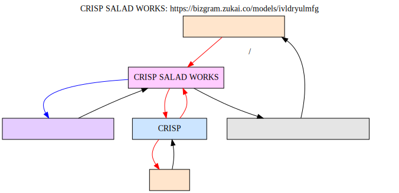

bizgram
=======

Bizgram（ビジネスモデル図解）をRubyコードで書くためのDSLライブラリです。
このライブラリで定義したビジネスモデルは、[DOT言語](https://ja.wikipedia.org/wiki/DOT%E8%A8%80%E8%AA%9E)コードとして出力され、[Graphviz](https://graphviz.org/)を通すことで、Bizgram（ビジネスモデル図解）として描画できます。

- 資料：[ビジネスモデル図解ツールキット配布版](./reference/ビジネスモデル図解ツールキット配布版.pdf)

特徴
----

- **Rubyの内部DSL** - Rubyの文法をそのまま活用でき、専用パーサーが不要
- **シンプルな記述ルール** - Rubyを知らなくてもBizgramが定義できる？
- **テキストで定義** - 変更差分がGitで管理しやすいテキストデータ

セットアップ
-----------

### 要件
- Ruby 3.0 以上

### インストール

```bash
bundle install
```

使用方法
--------

### 例

```ruby
require "bizgram"

dot = Bizgram.draw("CRISP SALAD WORKS: https://bizgram.zukai.co/models/ivldryulmfg") do
  # 主体の定義
  user = user("オフィス街で働く人", :ct)
  salad = object("栄養満点で主食になるサラダ", :lm)
  service = device("CRISP SALAD WORKS", :cm)
  info = info("顧客の行動分析データ", :rm)
  company = company("株式会社CRISP", :cb)
  staff = user("従業員", :rb)
  # モノ・カネ・情報の定義
  arrow(:money, "デジタル注文/支払", user, service)
  arrow(:object, "短い待ち時間で提供", salad, user)
  arrow(:object, "店舗で手作り", service, salad)
  arrow(:information, "顧客データ", service, info)
  arrow(:information, "運用改善", info, service) # TODO: type :other
  arrow(:money, "売上", service, company)
  arrow(:money, "運営", company, service)
  arrow(:money, "時給", company, staff)
  arrow(:money, "勤務", staff, company) # TODO: type :other

end

puts dot
```

このコードは以下のような DOT言語コードを出力します：

```sh
ruby example/crisp-salad-works.rb
```
```
digraph Bizgram {
  graph [label="CRISP SALAD WORKS: https://bizgram.zukai.co/models/ivldryulmfg", labelloc=top];
  rankdir=TB;

  node_1 [label="オフィス街で働く人", shape=box, style=filled, fillcolor="#FFE5CC"];
  node_3 [label="栄養満点で主食になるサラダ", shape=box, style=filled, fillcolor="#E5E5E5"];
  node_4 [label="CRISP SALAD WORKS", shape=box, style=filled, fillcolor="#FFCCFF"];
  node_5 [label="顧客の行動分析データ", shape=box, style=filled, fillcolor="#E5CCFF"];
  node_7 [label="株式会社CRISP", shape=box, style=filled, fillcolor="#CCE5FF"];
  node_8 [label="従業員", shape=box, style=filled, fillcolor="#FFE5CC"];

  node_1 -> node_4 [label="デジタル注文/支払", color=red];
  node_3 -> node_1 [label="短い待ち時間で提供", color=black];
  node_4 -> node_3 [label="店舗で手作り", color=black];
  node_4 -> node_5 [label="顧客データ", color=blue];
  node_5 -> node_4 [label="運用改善", color=blue];
  node_4 -> node_7 [label="売上", color=red];
  node_7 -> node_4 [label="運営", color=red];
  node_7 -> node_8 [label="時給", color=red];
  node_8 -> node_7 [label="勤務", color=red];
}
```
このコードは以下のような 図を出力します：

```sh
ruby example/crisp-salad-works.rb | dot -Tsvg -o example/crisp-salad-works.svg
```


#### DOT言語コードを Graphviz で画像化

生成された DOT言語コードを Graphviz で処理して図を作成できます：

```bash
# SVG形式で出力
dot -Tsvg output.dot -o diagram.svg

# PNG形式で出力
dot -Tpng output.dot -o diagram.png

# Ruby スクリプトの出力を直接 Graphviz に渡す
ruby example.rb | dot -Tsvg -o diagram.svg
```

オンラインツール：https://dreampuf.github.io/GraphvizOnline/ で試すこともできます。

テスト
------

すべてのテストを実行：

```bash
bundle exec rspec
```

特定のテストファイルを実行：

```bash
bundle exec rspec spec/bizgram_spec.rb
```

仕様書
------

実装の詳細や内部の設計については、以下を参照してください：

- [外部仕様](./specification.md#外部仕様) - ユーザー向けのメソッド仕様
- [内部仕様](./specification.md#内部仕様) - アーキテクチャ、クラス設計、バリデーション

この先の開発の方向性については、以下を参照してください：

- [ロードマップ](./ROADMAP.md) - やりたいことに優先度付けしたリスト


参照
----

- [Bizgram（ビジネスモデル図解）](https://bizgram.zukai.co/)
- [図解の説明書](https://bizgram.zukai.co/howto)
- [Graphviz](https://graphviz.org/)
- [DOT言語](https://ja.wikipedia.org/wiki/DOT%E8%A8%80%E8%AA%9E)