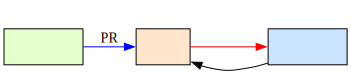

bizgram
=======

Bizgram（ビジネスモデル図解）をRubyコードで書くためのDSLライブラリです。
このライブラリで定義したビジネスモデルは、[Graphviz](https://graphviz.org/)の[DOT言語](https://ja.wikipedia.org/wiki/DOT%E8%A8%80%E8%AA%9E)として出力でき、図解として描画できます。

## 特徴

- **Rubyの内部DSL** - Rubyの文法をそのまま活用でき、専用パーサーが不要
- **柔軟な位置指定** - 主体の配置を数値、シンボル、座標で指定可能
- **自動配置** - 指定しない場合、Bizgramのルール（利用者は上段、事業は中段、事業者は下段）に従って自動配置
- **DOT言語出力** - Graphvizで描画可能な標準形式で出力

## セットアップ

### 要件
- Ruby 3.0 以上

### インストール

```bash
bundle install
```

## 使用方法

### 基本的な例

```ruby
require "bizgram"

# 図を定義する
dot_code = Bizgram.draw("オンライン書店のビジネスモデル") do
  # 利用者の定義
  user "読者"

  # 事業の定義
  business "書籍販売事業"

  # 事業者の定義
  operator "書店スタッフ"

  # 流れの定義
  money "書籍代金", user("読者"), business("書籍販売事業")
  object "書籍", business("書籍販売事業"), user("読者")
  information "PR", operator("書店スタッフ"), user("読者")
end

# DOT言語コードを出力（Graphvizで処理可能）
puts dot_code
```

#### DOTコードをGraphizで描画した結果



### 主体の定義

主体（利用者、事業、事業者）を定義します。

#### `user` / `business` / `operator`メソッド

```ruby
Bizgram.draw("Example") do
  user "ユーザー名"
  user "ユーザー名", :ct          # シンボル位置指定
  user "ユーザー名", [0, 0]       # 座標指定
  user "ユーザー名", 1            # 数値位置指定

  business "事業名"
  business "事業名", :cm          # 中央

  operator "事業者名"
  operator "事業者名", :cb        # 中央下
end
```

#### `entity`メソッド - 汎用

```ruby
Bizgram.draw("Example") do
  entity :user, "ユーザー"
  entity :business, "事業"
  entity :operator, "事業者"
end
```

### 位置指定

位置は3つの方法で指定できます。

#### 1. 数値指定（0～8）

3×3マスを左上から右下へ0～8の番号で指定：

```
0 1 2   (上段：利用者)
3 4 5   (中段：事業)
6 7 8   (下段：事業者)
```

```ruby
user "Alice", 0    # 左上
user "Bob", 4      # 中央
user "Charlie", 8  # 右下
```

#### 2. シンボル指定

横方向（l/c/r）と縦方向（t/m/b）の組み合わせ：

```ruby
user "Alice", :lt      # 左上
user "Bob", :cm        # 中央
operator "Staff", :rb  # 右下
```

#### 3. 座標指定（[x, y]）

```ruby
user "Alice", [0, 0]    # 左上
user "Bob", [1, 1]      # 中央
operator "Staff", [2, 2]  # 右下
```

#### 自動配置

位置を指定しない場合、自動配置されます：

```ruby
user "User1"           # 上段の最初の空き位置
user "User2"           # 上段の次の空き位置
business "Biz1"        # 中段の最初の空き位置
operator "Op1"         # 下段の最初の空き位置
```

### 流れの定義

モノ・カネ・情報の流れを矢印で定義します。

#### `object` / `money` / `information`メソッド

```ruby
Bizgram.draw("Example") do
  user "Customer", 1
  business "Shop", 4

  object "商品", user("Customer"), business("Shop")
  money "代金", user("Customer"), business("Shop")
  information "広告", operator("Staff"), user("Customer")
end
```

#### `arrow`メソッド - 汎用

```ruby
arrow :object, "商品", 0, 1
arrow :money, "代金", 1, 3
arrow :information, "情報", 2, 4
```

### 完全な例

```ruby
require "bizgram"

dot = Bizgram.draw("スマートフォン販売") do
  # 利用者
  user "消費者"

  # 事業
  business "小売事業"
  business "通信事業"
  provider = operator "通信事業者"

  # モノの流れ
  object "スマートフォン", business("小売事業"), user("消費者")
  object "通信サービス", business("通信事業"), user("消費者")

  # カネの流れ
  money "購入代金", user("消費者"), business("小売事業")
  money "通信料金", user("消費者"), business("通信事業")

  # 情報の流れ
  information "広告", provider, user("消費者")
end

puts dot
```

### 生成されたDOT言語をGraphvizで画像化

生成されたDOT言語コードをGraphvizで処理します：

```bash
# SVG形式で出力
dot -Tsvg output.dot -o diagram.svg

# PNG形式で出力
dot -Tpng output.dot -o diagram.png
```

オンラインツール：https://dreampuf.github.io/GraphvizOnline/

## テスト

すべてのテストを実行：

```bash
bundle exec rspec
```

特定のテストファイルを実行：

```bash
bundle exec rspec spec/bizgram_spec.rb
```

## ドキュメント

### 外部仕様にはない詳細情報

実装の詳細や内部の設計については、以下を参照してください：

- [外部仕様](./specification.md#外部仕様) - ユーザー向けのメソッド仕様
- [内部仕様](./specification.md#内部仕様) - アーキテクチャ、クラス設計、バリデーション

## 参照

- [Bizgram（ビジネスモデル図解）](https://bizgram.zukai.co/)
- [図解の説明書](https://bizgram.zukai.co/howto)
- [Graphviz](https://graphviz.org/)
- [DOT言語](https://ja.wikipedia.org/wiki/DOT%E8%A8%80%E8%AA%9E)