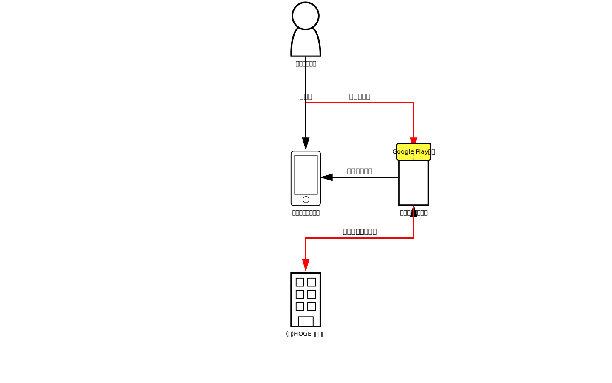

bizgram
=======

Bizgram（ビジネスモデル図解）をRubyコードで書くためのDSLライブラリです。
このライブラリで定義したビジネスモデルは、[DOT言語](https://ja.wikipedia.org/wiki/DOT%E8%A8%80%E8%AA%9E)コードとして出力され、[Graphviz](https://graphviz.org/)を通すことで、Bizgram（ビジネスモデル図解）として描画できます。

- 資料：[ビジネスモデル図解ツールキット配布版](./reference/ビジネスモデル図解ツールキット配布版.pdf)

特徴
----

- **Rubyの内部DSL** - Rubyの文法をそのまま活用でき、専用パーサーが不要
- **シンプルな記述ルール** - Rubyを知らなくてもBizgramが定義できる？
- **テキストで定義** - 変更差分がGitで管理しやすいテキストデータ

セットアップ
-----------

### 要件
- Ruby 3.0 以上

### インストール

```bash
bundle install
```

使用方法
--------

### 例

```ruby
require "bizgram"

dot = Bizgram.draw("例）買い切り型のスマホゲーム") do
  # 主体の定義
  user = user("ゲーム利用者", :ct)
  device = smartphone("利用者のデバイス", :cm)
  site = other("ゲーム配布サイト", 5)
  company = company("(株)HOGEゲームズ", 7)
  # モノ・カネ・情報の定義
  arrow(:money, "ゲーム購入", user, site)
  arrow(:object, "インストール", site, device)
  arrow(:other, "プレイ", user, device)
  arrow(:object, "作品アップロード", company, site)
  arrow(:money, "売上", site, company)
  # コメントの定義
  comment_to(site, "Google Play的な")
end

puts dot
```

このコードは以下のような SVGドキュメントを出力します：

```sh
ruby example/game.rb > example/game.svg
```



<details>
<summary>SVGコード</summary>

```svg
<?xml version="1.0" encoding="UTF-8" standalone="no"?>
<svg
  version="1.1"
  viewBox="0.0 0.0 1440.0 900.0"
  width="1440"
  height="900"
  xmlns="http://www.w3.org/2000/svg">
  <title>例）買い切り型のスマホゲーム</title>

  <!-- Entities -->
  <g id="entity_0">
    <rect x="683.23193" y="0" width="72.47241" height="132.75592" fill="#FFE5CC" stroke="#000000" stroke-width="4" />
    <text x="719.4681350000001" y="66.37796" font-size="24" font-family="sans-serif" text-anchor="middle" dominant-baseline="middle" fill
="#000000">ゲーム利用者</text>
  </g>
  <g id="entity_1">
    <rect x="683.23193" y="350.26513" width="72.47241" height="132.75592" fill="#FFCCFF" stroke="#000000" stroke-width="4" />
    <text x="719.4681350000001" y="416.64309000000003" font-size="24" font-family="sans-serif" text-anchor="middle" dominant-baseline="mi
ddle" fill="#000000">利用者のデバイス</text>
  </g>
  <g id="entity_2">
    <rect x="937.0625" y="350.26513" width="72.47241" height="132.75592" fill="#F0F0F0" stroke="#000000" stroke-width="4" />
    <text x="973.298705" y="416.64309000000003" font-size="24" font-family="sans-serif" text-anchor="middle" dominant-baseline="middle" f
ill="#000000">ゲーム配布サイト</text>
  </g>
  <g id="entity_3">
    <rect x="683.23193" y="635.41785" width="72.47241" height="132.75592" fill="#CCE5FF" stroke="#000000" stroke-width="4" />
    <text x="719.4681350000001" y="701.7958100000001" font-size="24" font-family="sans-serif" text-anchor="middle" dominant-baseline="mid
dle" fill="#000000">(株)HOGEゲームズ</text>
  </g>
  <!-- Arrows -->
  <g id="arrow_4">
    <line x1="719.4681350000001" y1="66.37796" x2="973.298705" y2="416.64309000000003" stroke="#FF0000" stroke-width="3" />
    <text x="846.3834200000001" y="231.51052500000003" font-size="16" font-family="sans-serif" text-anchor="middle" fill="#000000">ゲーム
購入</text>
  </g>
  <g id="arrow_5">
    <line x1="973.298705" y1="416.64309000000003" x2="719.4681350000001" y2="416.64309000000003" stroke="#000000" stroke-width="3" />
    <text x="846.3834200000001" y="406.64309000000003" font-size="16" font-family="sans-serif" text-anchor="middle" fill="#000000">インス
トール</text>
  </g>
  <g id="arrow_6">
    <line x1="719.4681350000001" y1="66.37796" x2="719.4681350000001" y2="416.64309000000003" stroke="#000000" stroke-width="3" />
    <text x="719.4681350000001" y="231.51052500000003" font-size="16" font-family="sans-serif" text-anchor="middle" fill="#000000">プレイ
</text>
  </g>
  <g id="arrow_7">
    <line x1="719.4681350000001" y1="701.7958100000001" x2="973.298705" y2="416.64309000000003" stroke="#000000" stroke-width="3" />
    <text x="846.3834200000001" y="549.21945" font-size="16" font-family="sans-serif" text-anchor="middle" fill="#000000">作品アップロー
ド</text>
  </g>
  <g id="arrow_8">
    <line x1="973.298705" y1="416.64309000000003" x2="719.4681350000001" y2="701.7958100000001" stroke="#FF0000" stroke-width="3" />
    <text x="846.3834200000001" y="549.21945" font-size="16" font-family="sans-serif" text-anchor="middle" fill="#000000">売上</text>
  </g>
  <!-- Comments -->
  <g id="comment_9">
    <rect x="933.298705" y="336.64309000000003" width="80" height="40" fill="#FFFC41" stroke="#000000" stroke-width="3" rx="5" />
    <text x="973.298705" y="356.64309000000003" font-size="14" font-family="sans-serif" text-anchor="middle" dominant-baseline="middle" f
ill="#000000">Google Play的な</text>
  </g>
</svg>
```
</details>


テスト
------

すべてのテストを実行：

```bash
bundle exec rspec
```

特定のテストファイルを実行：

```bash
bundle exec rspec spec/bizgram_spec.rb
```

仕様書
------

実装の詳細や内部の設計については、以下を参照してください：

- [外部仕様](./specification.md#外部仕様) - ユーザー向けのメソッド仕様
- [内部仕様](./specification.md#内部仕様) - アーキテクチャ、クラス設計、バリデーション

この先の開発の方向性については、以下を参照してください：

- [ロードマップ](./ROADMAP.md) - やりたいことに優先度付けしたリスト


参照
----

- [Bizgram（ビジネスモデル図解）](https://bizgram.zukai.co/)
- [図解の説明書](https://bizgram.zukai.co/howto)
- [Graphviz](https://graphviz.org/)
- [DOT言語](https://ja.wikipedia.org/wiki/DOT%E8%A8%80%E8%AA%9E)