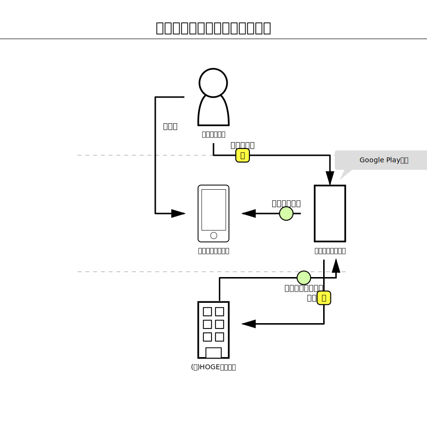

bizgram
=======

概要
--

Bizgram（ビジネスモデル図解）をRubyコードで書くためのDSLライブラリです。
このライブラリで定義したビジネスモデルは、Bizgramを表す SVG ドキュメントとして直接出力されます。

- 参考資料：[ビジネスモデル図解ツールキット配布版](./reference/ビジネスモデル図解ツールキット配布版.pdf)

特徴
--

- **Rubyの内部DSL** : Rubyの文法をそのまま活用でき、専用のパーサーが不要です。
- **シンプルな記述ルール** : 直感的な矢印構文（`- ... >`）などをサポートしており、非エンジニアでも簡単に定義可能です。
- **テキストで定義** : 差分がGitなどのバージョン管理システムで追いやすく、チームでの共同作業に向いています。

セットアップ
------

### システム要件
- Ruby 3.0 以上

### インストール

```bash
bundle install
```

使用方法
----

### 基本的な例

```ruby
require "bizgram"

svg = Bizgram.draw("例）買い切り型のスマホゲーム") do
  # 主体の定義
  user = user("ゲーム利用者", :ct)
  device = smartphone("利用者のデバイス", :cm)
  site = other("ゲーム配布サイト", 5)
  company = company("(株)HOGEゲームズ", 7)
  # モノ・カネ・情報の定義

  # 従来の記法（メソッド呼び出し）
  arrow(:object, "作品アップロード", company, site)

  # 直感的なDSL記法（- ... >）
  user -money("ゲーム購入")> site
  site -object("インストール")> device

  # コメントの定義
  comment_to(site, "Google Play的な")
end

puts svg
```

このコードは以下のような SVGドキュメントを出力します：

```sh
ruby example/01_normal.rb
```



他にも複雑な配置や多重矢印を試すためのサンプルコードを用意しています。
以下のコマンドをコピペして実行することで、それぞれのSVGを生成できます。

```sh
# ①ごく普通のBizgramコード
ruby example/01_normal.rb

# ②複雑なBizgramコード
ruby example/02_complex.rb

# ③意地悪な（多重・双方向など）Bizgramコード
ruby example/03_edge_case.rb

# ④新しい直感的なDSL記法のBizgramコード
ruby example/04_test_dsl.rb
```


テスト
---

すべてのテストを実行：

```bash
bundle exec rspec
```

特定のテストファイルを実行：

```bash
bundle exec rspec spec/bizgram_spec.rb
```

仕様書
---

実装の詳細や内部の設計については、以下を参照してください：

- [外部仕様](./specification.md#外部仕様) : ユーザー向けのメソッド仕様やDSLの文法
- [内部仕様](./specification.md#内部仕様) : アーキテクチャ、クラス設計、SVG生成ロジック

この先の開発の方向性については、以下を参照してください：

- [ロードマップ](./ROADMAP.md) : 今後実装したい機能や改善タスクの優先順位リスト


参照
--

- [Bizgram（ビジネスモデル図解）公式サイト](https://bizgram.zukai.co/)
- [Bizgram 図解の説明書](https://bizgram.zukai.co/howto)