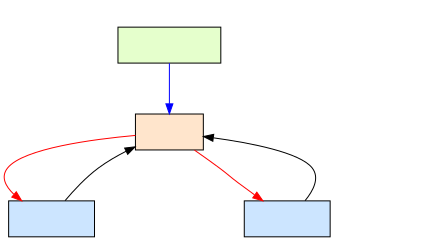

bizgram
=======

Bizgram（ビジネスモデル図解）をRubyコードで書くためのDSLライブラリです。
このライブラリで定義したビジネスモデルは、[DOT言語](https://ja.wikipedia.org/wiki/DOT%E8%A8%80%E8%AA%9E)コードとして出力され、[Graphviz](https://graphviz.org/)を通すことで、Bizgram（ビジネスモデル図解）として描画できます。

- 資料：[ビジネスモデル図解ツールキット配布版](./reference/ビジネスモデル図解ツールキット配布版.pdf)

特徴
----

- **Rubyの内部DSL** - Rubyの文法をそのまま活用でき、専用パーサーが不要
- **シンプルな記述ルール** - Rubyを知らなくてもBizgramが定義できる？
- **テキストで定義** - 変更差分がGitで管理しやすいテキストデータ

セットアップ
-----------

### 要件
- Ruby 3.0 以上

### インストール

```bash
bundle install
```

使用方法
--------

### 例

```ruby
require "bizgram"

dot = Bizgram.draw("スマートフォン販売ビジネスモデル") do
  # 利用者の定義
  consumer = user "消費者"

  # 事業の定義
  retail_biz = business "小売事業"
  telecom_biz = business "通信事業"

  # 事業者の定義
  telecom_provider = operator "通信事業者"

  # モノの流れ
  object "スマートフォン", retail_biz, consumer
  object "通信サービス", telecom_biz, consumer

  # カネの流れ
  money "購入代金", consumer, retail_biz
  money "通信料金", consumer, telecom_biz

  # 情報の流れ
  information "広告", telecom_provider, consumer

  # コメント（補足情報）の追加
  comment consumer, "最終ユーザー"
  comment_to retail_biz, "端末の販売"
  comment telecom_biz, "通信サービス提供"
  comment_to telecom_provider, "サポート体制"
end

puts dot
```

このコードは以下のような DOT言語コードを出力します：

```sh
ruby example/example_smartphone-seller.rb
```
```
digraph Bizgram {
  graph [label="スマートフォン販売ビジネスモデル", labelloc=top];
  rankdir=TB;

  node_0 [label="消費者", shape=box, style=filled, fillcolor="#FFE5CC"];
  node_3 [label="小売事業", shape=box, style=filled, fillcolor="#CCE5FF"];
  node_4 [label="通信事業", shape=box, style=filled, fillcolor="#CCE5FF"];
  node_6 [label="通信事業者", shape=box, style=filled, fillcolor="#E5FFCC"];
  comment_0 [label="最終ユーザー", shape=box, style="filled,rounded", fillcolor="#FFFFCC"];
  comment_1 [label="端末の販売", shape=box, style="filled,rounded", fillcolor="#FFFFCC"];
  comment_2 [label="通信サービス提供", shape=box, style="filled,rounded", fillcolor="#FFFFCC"];
  comment_3 [label="サポート体制", shape=box, style="filled,rounded", fillcolor="#FFFFCC"];

  node_3 -> node_0 [label="スマートフォン", color=black];
  node_4 -> node_0 [label="通信サービス", color=black];
  node_0 -> node_3 [label="購入代金", color=red];
  node_0 -> node_4 [label="通信料金", color=red];
  node_6 -> node_0 [label="広告", color=blue];
  comment_0 -> node_0 [style=dashed, color=gray];
  comment_1 -> node_3 [style=dashed, color=gray];
  comment_2 -> node_4 [style=dashed, color=gray];
  comment_3 -> node_6 [style=dashed, color=gray];
}
```
このコードは以下のような 図を出力します：

```sh
ruby example/example_smartphone-seller.rb | dot -Tsvg -o example/example_smartphone-seller.svg
```


#### DOT言語コードを Graphviz で画像化

生成された DOT言語コードを Graphviz で処理して図を作成できます：

```bash
# SVG形式で出力
dot -Tsvg output.dot -o diagram.svg

# PNG形式で出力
dot -Tpng output.dot -o diagram.png

# Ruby スクリプトの出力を直接 Graphviz に渡す
ruby example.rb | dot -Tsvg -o diagram.svg
```

オンラインツール：https://dreampuf.github.io/GraphvizOnline/ で試すこともできます。

テスト
------

すべてのテストを実行：

```bash
bundle exec rspec
```

特定のテストファイルを実行：

```bash
bundle exec rspec spec/bizgram_spec.rb
```

仕様書
------

実装の詳細や内部の設計については、以下を参照してください：

- [外部仕様](./specification.md#外部仕様) - ユーザー向けのメソッド仕様
- [内部仕様](./specification.md#内部仕様) - アーキテクチャ、クラス設計、バリデーション

この先の開発の方向性については、以下を参照してください：

- [ロードマップ](./ROADMAP.md) - やりたいことに優先度付けしたリスト


参照
----

- [Bizgram（ビジネスモデル図解）](https://bizgram.zukai.co/)
- [図解の説明書](https://bizgram.zukai.co/howto)
- [Graphviz](https://graphviz.org/)
- [DOT言語](https://ja.wikipedia.org/wiki/DOT%E8%A8%80%E8%AA%9E)