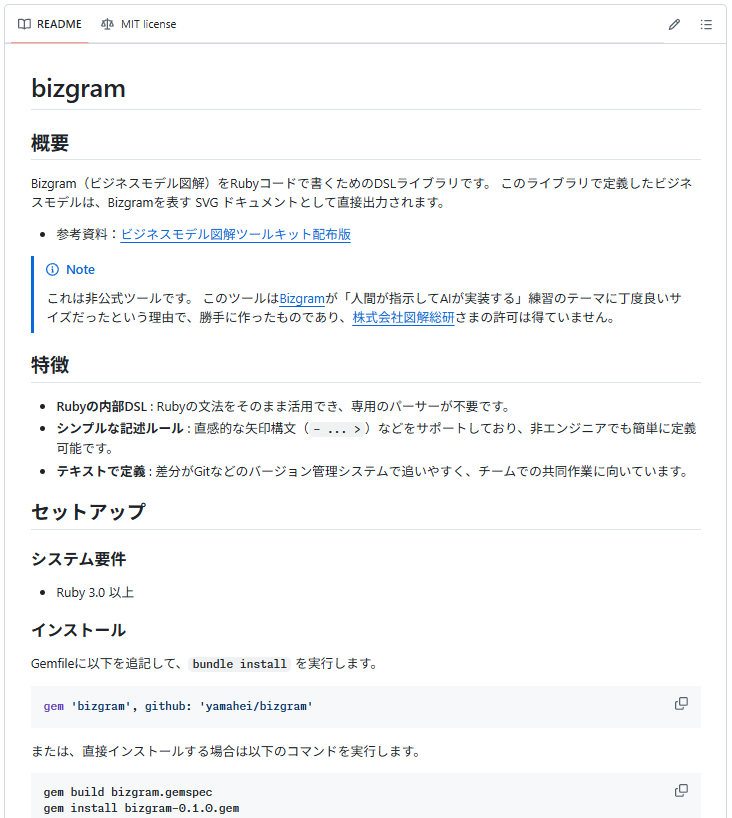
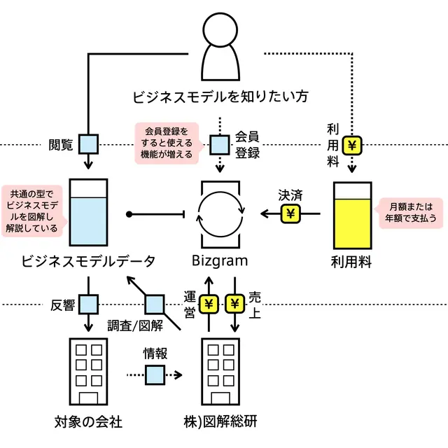
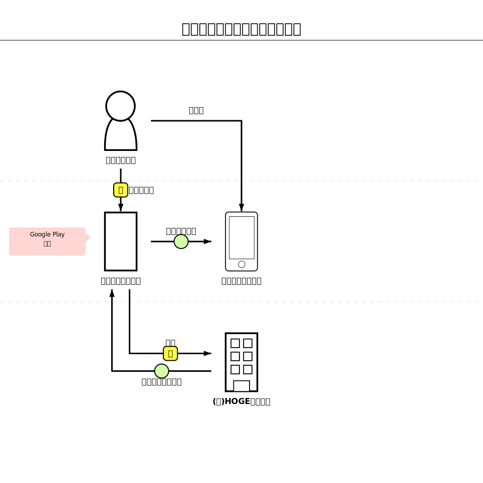
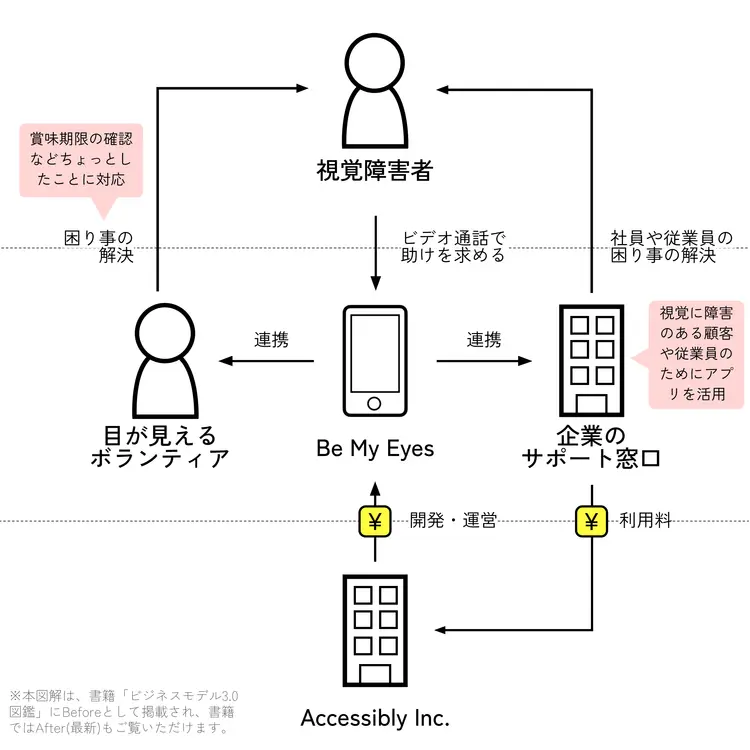
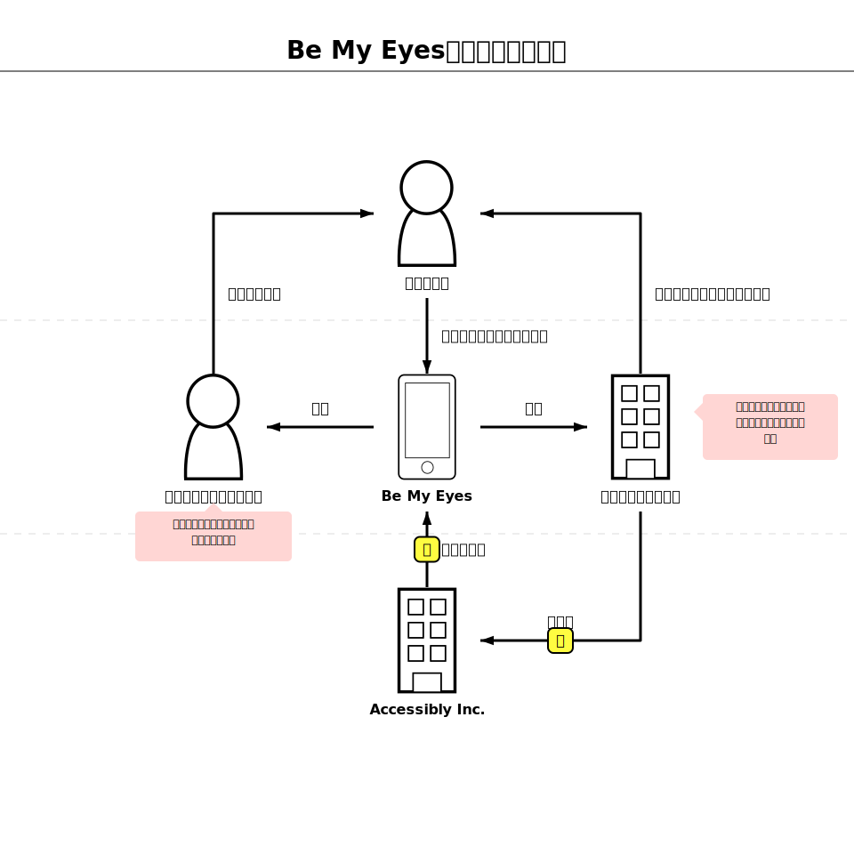
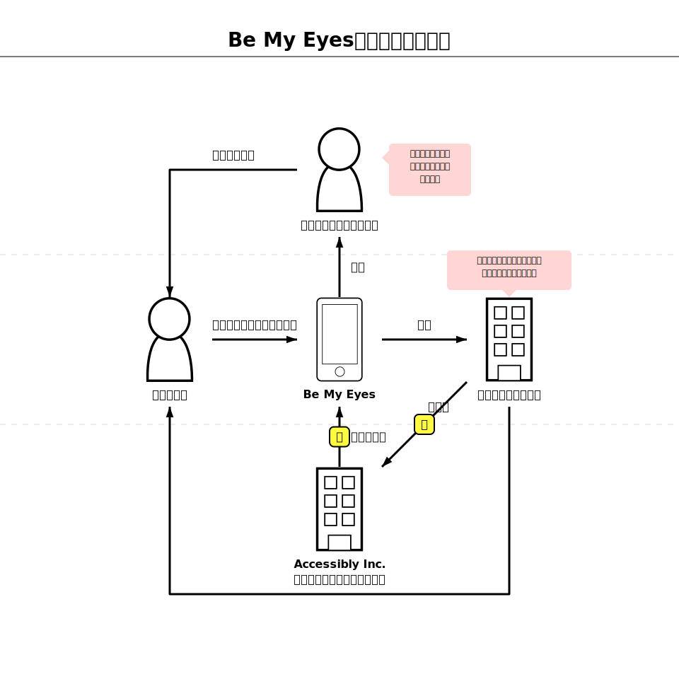
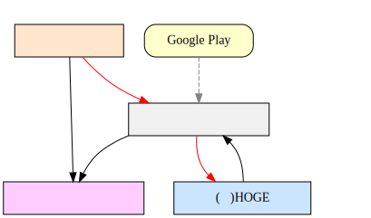
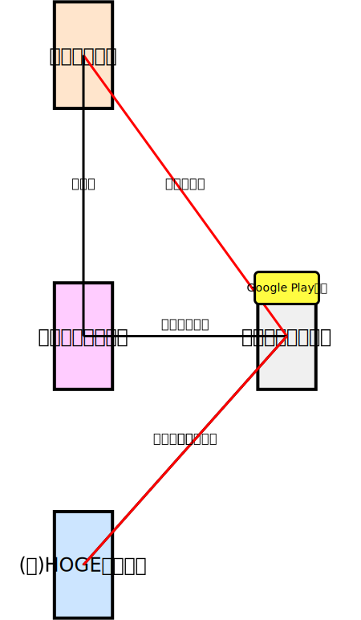

<style>
    p, li { font-size:20px; }
    div.flex { display: flex; }
    div.flex > * { flex: 1; padding: 0 3rem 3rem 0; }
    th { white-space: nowrap; }
</style>

# ENgineer UNite #11
## 個人開発自慢LT大会

<small>エクスウェア株式会社</small>

山折 一平

---



# 作ったもの
## bizgram
https://github.com/yamahei/bizgram

- テキストで**Bizgram**が書ける
- AIに実装させる練習用
- 非公式（**無許可**）


---



Bizgramとは
===========

ビジネスモデルを図解で紹介するデータベース

> Bizgramは、企業のビジネスモデルを9マスの図解と解説で紹介するギャラリーだ。ビジネスの仕組みをより多くの人が知り、「ビジネスって面白い！」とか「自分だったらこう考えるかも」といったきっかけをつくるために生み出された。主に、企業で新しい事業を立ち上げようとしている人や、起業家、またはビジネスを学ぶ学生など、ビジネスモデルに関心のある方が対象だ。

- 図解総研
  https://zukai.co/
- Bizgram ギャラリー
  https://bizgram.zukai.co/gallery/bizgram

---

# こんな感じ



```ruby
require "bizgram"

svg = Bizgram.draw("例）買い切り型のスマホゲーム") do

  # 主体の定義
  user = user("ゲーム利用者")
  device = smartphone("利用者のデバイス", :cm)# 明示的な配置指定
  site = other("ゲーム配布サイト")

  # モノ・カネ・情報の流れを定義
  user -money("ゲーム購入")> site
  site -object("インストール")> device
  arrow(:other, "プレイ", user, device)# 旧来の記法

  ## 主体は直接書くこともできる
  company("(株)HOGEゲームズ", :cb) -object("作品アップロード")> site
  site -money("売上")> company("(株)HOGEゲームズ")

  # コメントの定義
  comment_to(site, "Google Play的な")

end

puts svg
```

`Graphiz`とか`PlantUML`とか`Mermaid.js`みたいなのを、**RubyDSL**で実装

---

# 割といい感じの仕上がり

|Original|配置指定|自動配置|
|-|-|-|
||||

**矢印**と**コメント**は常に自動配置、**主体**の配置は自動/指定が選択可能

---

# 見栄えの調整に一番時間がかかった
|Graphiz版(最初期)→|SVG版(初期)→|SVG版(現在)|
|-|-|-|
||||

---

# 自動配置アルゴリズムは丸投げでは無理だった

<div class="flex">
<div>

## アルゴリズム概要

**主体の配置**
1. 矢印接続数で主体をソート（最多を中央に）
2. **深さ優先**で連なる主体を配置
3. 置き場所が足りない場合は**平行移動**

**矢印の配置**
1. 主体の上を通過しない（行列の合成で判定）
2. 矢印の選択優先度は「直線→L字→斜め→U字」
3. 配置済みの矢印と交差しない（並走はOK）

**コメントの配置**
1. 配置済みの主体・矢印に被らない
</div>
<div>

## 指示の出し方
1. **specification.md：達成したいゴールとしての（外部）仕様**
2. **ROADMAP.md：現在の（小さな）目標**
   - 優先度もAIと相談する
3. **ロードマップを1つずつ実行**
   - 適宜指摘する（プロンプト）
   - 情報不足は適宜加筆修正（specification.md）
</div>
</div>

---

# 利用AIの変遷

| # | AI                                                                      | エンジン         | 評価 | 所感                                                     |
|:-:|:------------------------------------------------------------------------|:-----------------|:-----|:---------------------------------------------------------|
| 1 | Gemini CLI      | Gemini系         | △   | 作れなくはないが、自分で作ったほうが早い                 |
| 2 | Github Copilot                | Claude Haiku 4.5 | △   | 成果にダメ出しすると、パニックになって余計な変更しまくる |
| 3 | Antigravity  | Gemini系ほか     | 〇   | 丁寧に指示すれば、期待したものを動くレベルで作ってくれる |


同じGeminiなのにGemini CLIとAntigravityの差がスゴイ（謎）

---

# おまけ①
## `eval`の実装

<div class="flex">
<div>

```ruby
require "bizgram"

dsl_code = <<~RUBY
  Bizgram.draw("例") do
    user = user("利用者")
    bus = business("事業者")
    user -money("購入")> bus
  end
RUBY

# AST検証を通過したものだけが実行される
svg = Bizgram.eval(dsl_code)
puts svg
```

</div>
<div>

Web上でユーザーが入力した文字列をSVG化する場合など、セキュリティが求められる環境向けに `Bizgram.eval` を用意。

内部でRubyの標準ライブラリ（`Ripper`）を用いて構文木（AST）を解析し、危険なコード（システムコマンドやメソッド実行、リフレクション攻撃など）を弾く設計。

</div>
</div>

---

# おまけ②
## システム化範囲の表現（`systemize`）


指定した主体や矢印を特定のシステム（業務）範囲としてグループ化し、SVG上で縁取り（ハイライト）して視覚化。

最上流の資料（ビジネス要件/システム化範囲）として使えないか、実験的に実装。

---

# おわり
## ご清聴 ありがとうございました。


powered by Marp
https://marp.app/
