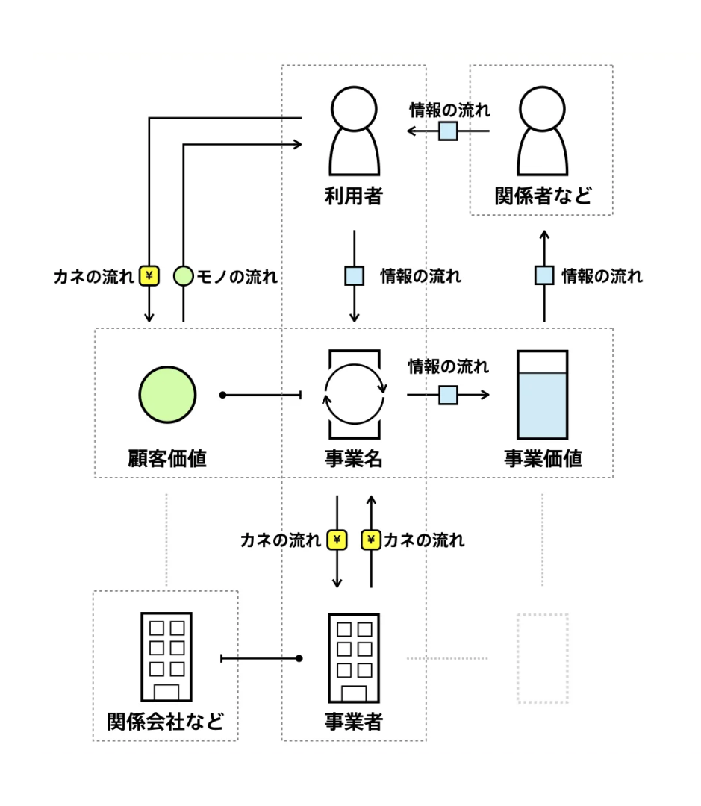

<style>
    p, li, blockquote, table { font-size:20px; }
    div.flex { display: flex; }
    div.flex > * { flex: 1; padding: 0 3rem 3rem 0; }
    th { white-space: nowrap; }
</style>

# ENgineer UNite #11
## 個人開発自慢LT大会

<small>エクスウェア株式会社</small>

山折 一平

---


# 作ったもの
## bizgram
https://github.com/yamahei/bizgram

- テキストで**Bizgram**を描くツール（RubyDSL→SVG）
- AIを使ったプログラミング練習用テーマ


---



ビズグラム(ビジネスモデル図解)とはなにか？
==========================================

- [ビズグラム(ビジネスモデル図解)](https://zukai.co/pages/bizgram?srsltid=AfmBOorINdFn2NDfc8KL1JZkEOeDipiLJ1WalsN-3Kgw2EvTJTcasD4S)

> ビズグラム(ビジネスモデル図解)とは、ある企業のサービスの事業者や利用者がどう関わりお金が循環するのかを表現している図です。そのビジネスがどのように経済合理性を実現しているのか、そのビジネスの特徴は何かが一目で分かります。
>
> ビズグラムを使うことで、自社のビジネスを可視化するだけでなく、自社の経営資源や強みを把握したり、投資家や経営陣に対する説明資料としても活用することができます。

※なお、**無許可**

---

# こんな感じで描ける


```ruby
require "bizgram"

svg = Bizgram.draw("例）買い切り型のスマホゲーム") do

  # 主体の定義
  user = user("ゲーム利用者")
  device = smartphone("利用者のデバイス", :cm)# 明示的な配置指定
  site = other("ゲーム配布サイト")

  # モノ・カネ・情報の流れを定義
  user -money("ゲーム購入")> site
  site -object("インストール")> device
  arrow(:other, "プレイ", user, device)# 旧来の記法

  ## 主体は直接書くこともできる
  company("(株)HOGEゲームズ", :cb) -object("作品アップロード")> site
  site -money("売上")> company("(株)HOGEゲームズ")

  # コメントの定義
  comment_to(site, "Google Play的な")

end

puts svg
```

`Graphviz`とか`PlantUML`とか`Mermaid.js`みたいなのをイメージしてる。

---

# 割といい感じの仕上がり

|Original|配置指定|自動配置|
|-|-|-|
||||

**矢印**と**コメント**は常に自動配置、**主体**の配置は自動/指定が選択可能

---

# 見栄えの調整に一番時間がかかった
|Graphviz版(最初期)|SVG版(初期)|SVG版(現在)|
|-|-|-|
||||

---

# 自動配置アルゴリズムはAI丸投げでは無理だった

<div class="flex">
<div>

## アルゴリズム

**①主体の配置**
1. 矢印接続数で主体をソート（最多を中央に）
2. **深さ優先**で連なる主体を隣に配置
3. 置き場所が足りない場合は**平行移動**

**②矢印の配置**
1. 主体の上を通過しない（行列の合成で判定）
2. 矢印の選択優先度は「直線→L字→斜め→U字」
3. 配置済みの矢印と交差しない（並走はOK）

**③コメントの配置**
1. 配置済みの主体・矢印に**なるべく**被らない
   （無理なら諦めて被せる）
</div>
<div>

## 指示の出し方
1. **specification.md：達成したいゴールとしての（外部）仕様**
   - 初期は主に人間が作成、徐々にAIに任せるようになった
2. **ROADMAP.md：現在の（小さな）目標**
   - タスク分解が品質に強く影響してる印象
3. **ロードマップを1つずつ実行**
   - 適宜指摘する（プロンプト）
   - 情報不足は適宜加筆修正（specification.md）
     →コイツ分かってないな、と思ったら
</div>
</div>

---

# 利用AIの変遷

| # | AI                                                                      | エンジン         | 評価 | 所感                                                                     |
|:-:|:------------------------------------------------------------------------|:-----------------|:-----|:-------------------------------------------------------------------------|
| 1 |  Gemini CLI    | Gemini系         | △   | 作れなくはないが、自分で作った方が早いレベル                           |
| 2 |  Github Copilot              | Claude Haiku 4.5 | △   | ↑より多少マシだが、ダメ出しに弱い<br>（パニックになって余計な変更しまくる） |
| 3 |  Antigravity | Gemini系ほか     | 〇   | **丁寧に指示すれば**、期待したものを動くレベルで作ってくれる             |


同じGeminiなのにGemini CLIとAntigravityの差がスゴイ（謎）

---

# 結局、言いたい事

<div class="flex">
<div>

## アイデアは人間が出すべき
核となる価値の実装はAI任せにしない方が良い。
（芯食ってないアルゴリズムを延々試すばかりで、ゴールに辿り着かない。

下記3点はまだしばらく人間の領域の予感。

- **アイデア実現手段**
  - 基本的なアルゴリズム
- **価値の見極め**
  - ドメイン駆動設計
- **作業の優先度と品質管理**
  - プロジェクトマネジメント

</div>
<div>

## AI課金の時期がやってきた
無料枠で色々試してきたが、Antigravityの精度が実用的なので、課金に踏み切った。

Antigravityが最強か、というのは分からないが、最近流行の「AIエージェント」というアプローチが、AIプログラミングを実用に耐える精度まで引き上げた、と理解。

変化（進化）が早いので、1年課金が正解だったのかは分からない。

</div>
</div>


---

# おまけ①

<div class="flex">
<div>

## SVG中に全ての属性を出力

Bizgramに指定したすべての情報が、SVGに属性として埋め込まれているので、（やる気があれば）SVGからBizgram定義が復元できる。

</div>
<div>

```xml
<!-- 前略 -->
<g id='entities'>
  <g id='entity_0'
    data-bizgram-object='entity'
    data-bizgram-type='user'
    data-bizgram-name='ゲーム利用者'
    data-bizgram-position='0'>
<!-- 中略 -->
<g id='arrows'>
  <g id='arrow_4'
    data-bizgram-object='arrow'
    data-bizgram-type='money'
    data-bizgram-name='ゲーム購入'
    data-bizgram-from='entity_0'
    data-bizgram-to='entity_2'>
<!-- 後略 -->
```

</div>
</div>


---

# おまけ②
## `eval`の実装

<div class="flex">
<div>

```ruby
require "bizgram"

dsl_code = <<~RUBY
  Bizgram.draw("例") do
    user = user("利用者")
    bus = business("事業者")
    user -money("購入")> bus
  end
RUBY

# AST検証を通過したものだけが実行される
svg = Bizgram.eval(dsl_code)
puts svg
```

</div>
<div>

### 一般公開を想定した対応
Web上でユーザーが入力した文字列をSVG化する場合など、セキュリティが求められる環境向けに `Bizgram.eval` を用意。

### 安全性も確保
内部でRubyの標準ライブラリ（`Ripper`）を用いて構文木（AST）を解析し、危険なコード（システムコマンドやメソッド実行、リフレクション攻撃など）を弾く設計。

</div>
</div>

---

# おまけ③
## システム化範囲の表現（`systemize`）


指定した主体や矢印を特定のシステム（業務）範囲としてグループ化し、ハイライトして視覚化。

最上流の資料（ビジネス要件/システム化範囲）として使えないか、実験的に実装。

---

# おわり
## ご清聴 ありがとうございました。


powered by Marp
https://marp.app/
